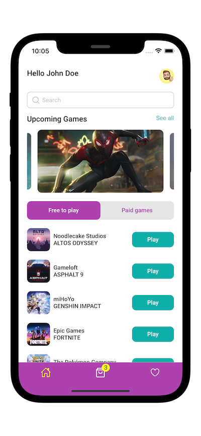

## Add in the <project root>/react-native.config.js

```
module.exports = {
project: {
ios: {},
android: {},
},
assets: ['./assets/fonts/'],
};
```

## --------------------------------------------

## Adding React Native Vector Icons

## Add <project root>/ios/info.plist

```
<key>UIAppFonts</key>
<array>
<string>AntDesign.ttf</string>
<string/>
<string>EvilIcons.ttf</string>
<string>Feather.ttf</string>
<string>FontAwesome.ttf</string>
<string>FontAwesome5_Brands.ttf</string>
<string>FontAwesome5_Regular.ttf</string>
<string>FontAwesome5_Solid.ttf</string>
<string>Fontisto.ttf</string>
<string>Foundation.ttf</string>
<string>Ionicons.ttf</string>
<string>MaterialCommunityIcons.ttf</string>
<string>MaterialIcons.ttf</string>
<string>Octicons.ttf</string>
<string>SimpleLineIcons.ttf</string>
<string>Zocial.ttf</string>
<string>Montserrat-Italic-VariableFont_wght.ttf</string>
<string>Montserrat-VariableFont_wght.ttf</string>
<string>Neucha-Regular.ttf</string>
<string>Trispace-VariableFont.ttf</string>
<string>McLaren-Regular.ttf</string>
</array>
```

## --------------------------------------------

## Add <project root>/android/app/build.gradle

At the end of the file >>>

```
apply from: "../../node_modules/react-native-vector-icons/fonts.gradle"
```

## --------------------------------------------

## Append <project root>/metro.config

```
const {getDefaultConfig} = require('metro-config');

module.exports = (async () => {
const {
resolver: {sourceExts, assetExts},
} = await getDefaultConfig();
return {
transformer: {
babelTransformerPath: require.resolve('react-native-svg-transformer'),
},
resolver: {
assetExts: assetExts.filter(ext => ext !== 'svg'),
sourceExts: [...sourceExts, 'svg'],
},
};
})();
```

## --------------------------------------------

## Copy fonts directory to <project root>/ios/fonts (from react vector icons)

```
AntDesdign.ttf
Entypo.ttf
Evilicons.ttf
...
(Around 16 files)
```

## --------------------------------------------

## Append at the end of the file: <project root>/android/app/src/main/java/com/<project name>/MainActivity.java

```
@Override
protected void onCreate(Bundle savedInstanceState) {
super.onCreate(null);
}
```

## --------------------------------------------

## Packages to install:

```
npm i @react-navigation/bottom-tabs @react-navigation/drawer @react-navigation/native @react-navigation/native-stack react-native-date-picker react-native-gesture-handler react-native-reanimated react-native-safe-area-context react-native-screens react-native-snap-carousel react-native-svg react-native-svg-transformer react-native-vector-icons

"@react-navigation/native": "^6.0.13",
"@react-navigation/native-stack": "^6.9.1",
"@rneui/base": "^4.0.0-rc.7",
"@rneui/themed": "^4.0.0-rc.7",
"react": "18.1.0",
"react-native": "0.70.4",
"react-native-safe-area-context": "^4.4.1",
"react-native-screens": "^3.18.2",
"react-native-svg": "^13.4.0",
"react-native-svg-transformer": "^1.0.0",
"react-native-vector-icons": "^9.2.0"
```

## --------------------------------------------

```
1. npx pod-install ios // pod install
2. npx react-native-asset // link assets
3. npx react-native run-ios // RUN
```

## --------------------------------------------

<div>
<p>
    
</p>
<p>
    
</p>

</div>

## --------------------------------------------

# App Screenshots




## --------------------------------------------

## Errors/issues

```
Invariant Violation: ViewPropTypes has been removed from React Native. Migrate to ViewPropTypes exported from 'deprecated-react-native-prop-types'

https://stackoverflow.com/questions/72755476/invariant-violation-viewproptypes-has-been-removed-from-react-native-migrate-t
```

### For react-native-reanimated add plugins: ['react-native-reanimated/plugin'] to babel.config.js
